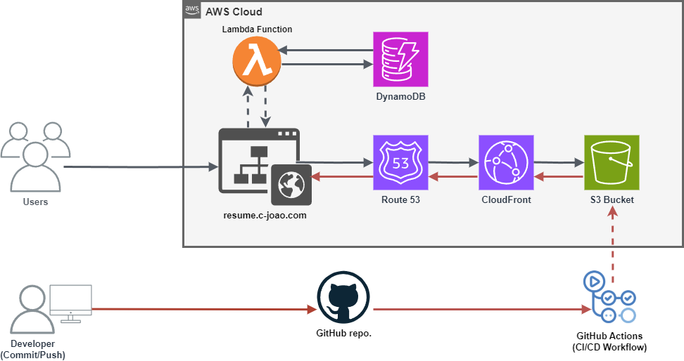

# Cloud Resume (AWS, CI/CD)

This project involved creating a static resume website hosted on AWS with various services to handle hosting, deployment, and analytics.

## Architecture Overview

- **S3**: The resume website is stored in an S3 bucket. This acts as the static file hosting service.
- **CloudFront**: CloudFront is used as the Content Delivery Network (CDN), making the website globally accessible.
- **Route 53**: A custom domain was configured via Route 53, allowing users to access the website through a personalized URL. An SSL certificate was added using AWS Certificate Manager (ACM) to ensure the site is served over HTTPS.

### View Count

- **DynamoDB**: The number of viewers visiting the website is tracked using DynamoDB.
- **Lambda**: A Python-based Lambda function is used to increment and update the viewer count on each page visit.

### CI/CD Pipeline

- **GitHub Actions**: The project uses GitHub Actions to automate the deployment of the website.
  - A custom workflow is set up to sync changes from the GitHub repository to the S3 bucket via CloudFront.
  - This ensures that the website is automatically updated whenever there are commits to the main branch.

### Future Work

- **Terraform**: In the next stage of the project, Terraform will be implemented for infrastructure management, enabling automated provisioning and scaling of resources.